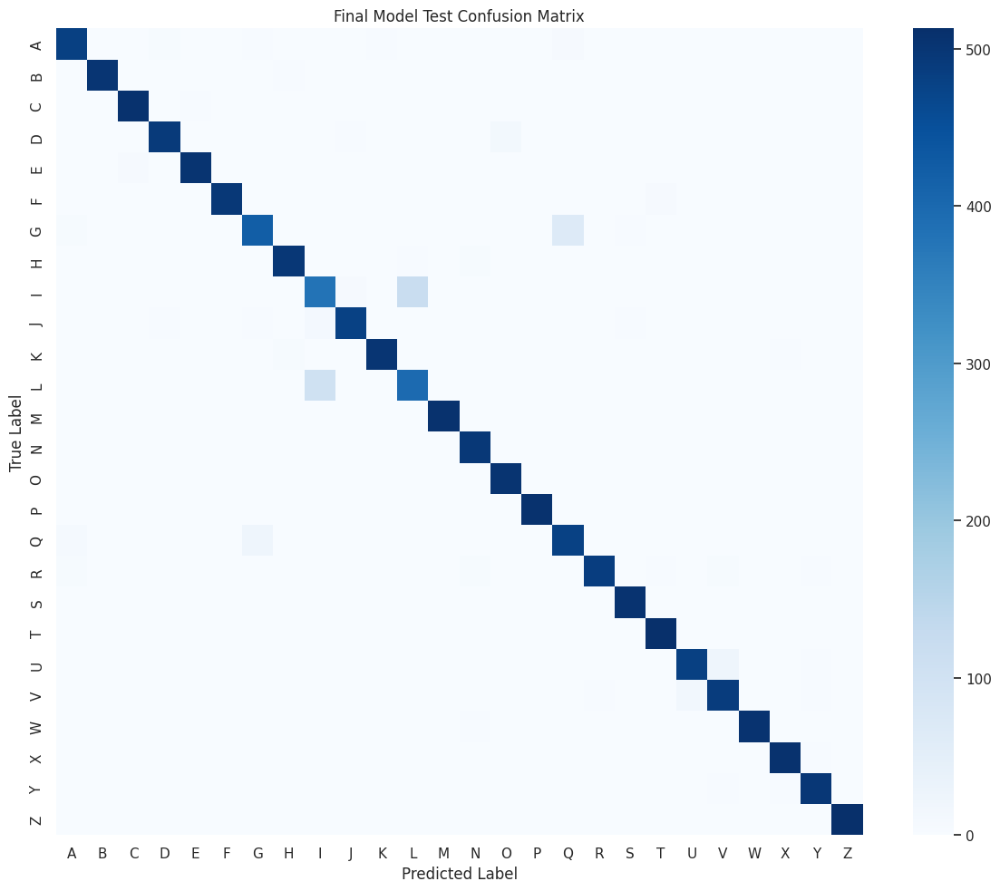
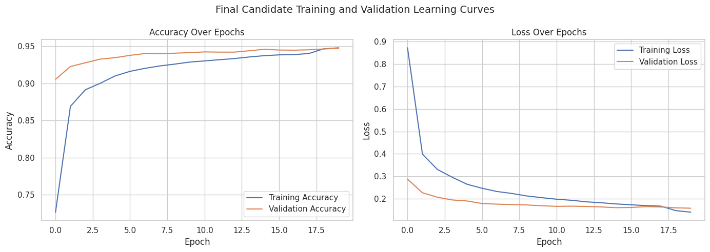

# Handwritten Letter Classification with CNNs

A 26-class handwritten-letter classification project using 28×28 grayscale images and convolutional neural networks.



## Overview

The notebook begins with data-integrity checks and a dense-network baseline, then develops CNN candidates through controlled validation experiments. It concludes with a locked-model test evaluation, confusion-pair analysis, confidence analysis, misclassified examples, and feature-map inspection.

## Dataset

The dataset is **not included**. The original notebook expects `datasets/emnist-letters.csv`, with the label in column 0 and 784 pixel columns; it describes the data as EMNIST-style handwritten letters. No redistribution terms or a direct dataset source are identified in the supplied material, so the data has not been copied here.

Create a local `datasets/` directory and place the CSV at that path. In the notebook, `DATA_PATH` can be changed if it lives elsewhere.

## Final model and results

The selected model is a three-block CNN with 32, 64, and 128 convolution filters, max pooling after each block, `Dropout(0.7)`, a 128-unit dense layer, and a 26-way softmax output. It was selected using validation macro F1 with Adam (initial learning rate 0.001) and `ReduceLROnPlateau` (patience 3); BatchNorm and the tested augmentation policies were not selected.

| Test metric | Result |
| --- | ---: |
| Loss | 0.1450 |
| Accuracy | 0.9495 |
| Macro F1 | 0.9494 |
| Weighted F1 | 0.9494 |

The main remaining errors were visually similar letters, especially I/L, G/Q, and U/V. Feature maps are included as qualitative inspection, not a claim of full model explainability.



## Repository structure

```text
notebooks/handwritten_letter_classification.ipynb  # full experiment record
evaluation/evaluate_cnn_model.ipynb                # reload and evaluate final weights
models/final_cnn.weights.h5                        # selected final weights
assets/                                             # selected existing notebook figures
```

## Running the project

1. Install dependencies: `pip install -r requirements.txt`.
2. Provide `datasets/emnist-letters.csv` as described above.
3. From the repository root, open `notebooks/handwritten_letter_classification.ipynb`. The evaluation notebook can reload the included weights after the dataset is available.

Training results reflect the documented run; neural-network retraining may vary slightly by environment.

## Limitations

This is a handwritten-letter classifier, not a complete OCR system. The source dataset contains visually ambiguous handwriting, and the project does not establish performance beyond the provided data.

## Coursework context

This project originated as coursework for a Deep Learning module at Singapore Polytechnic and has been cleaned and reorganised for public presentation.

Author: Agne Rudhresh
